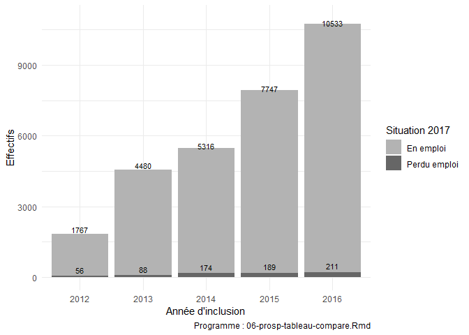

06-prosp-tableau-compare
================
Marie Plessz
05/11/2020

# préparer les données

``` r
data_orig <- read_dta("Data/Cree/HDR6_04_prosp_studypop.dta")

# isoler les noms des vars à traiter comme des facteurs
to_factor <- data_orig %>%
    select( -age,  -proj_isp, -fm_per_inclusion, -traveffr) %>% 
    select( -matches("_c_")) %>% 
    select( -matches("_n_") )%>%                        
    map_lgl(is.numeric) %>%
        names

# traiter les facteurs
df <- data_orig %>% 
    mutate_at(to_factor, as_factor) %>% 
    mutate_if(is.factor, fct_drop) %>% 
        # se débarrasser des levels vides
    rename(y_incl = y ) # évite ambiguités

# variables binaires converties en type "logique"
    # les sélectionner
to_lgl <-df %>%
    select_if(~length(levels(.))==2)    %>% 
    map_lgl(is.numeric) %>%
        names

    # créer les variables binaires. pour l'instant elles ont le même nom dans un autre objet.

# ATTENTION : suppose que 1 est toujours la modalité "oui"

lg <- data_orig %>% select(proj_isp, all_of(to_lgl) ) %>% 
    mutate_at(vars(all_of(to_lgl)), ~if_else(. == 1, "T", "F") ) %>% 
    mutate_at(vars(all_of(to_lgl)), as.logical ) 

    # join en renommant les logiques
df <- left_join(df, lg, by= "proj_isp", suffix = c("", "_l"))

df$traveffr_c<- as.numeric(as.character(df$traveffr))
```

``` r
# labels
var_label(df) <- list(homme_l = "Homme", 
                                 aveccouple01_l = "Vit en couple",
                                 avecenf01_l = "Vit avec enfant(s)",
                                 diffinnow_l = "Difficultés financières",
                                 age_cl = "Tranche d'âge",
                                 tuu2012_cl = "Taille unité urbaine",
                                 edu = "Diplôme",
                                 prive_l = "Secteur privé",
                                 astopsante_l = "A eu arrêts >6 mois (santé)",
                                 astopcho_l = "A eu arrêts >6 mois (chômage)",
                                 san_o_inc = "Santé perçue",
                                 traveffr_c = "Effort physique au travail (max=14)",
                                 y_incl = "Année d'inclusion")
```

# tableau caractéristiques cas et temoins

J’utilise le package `gtsummary`.

``` r
# noms
prog <- glue("Programme: {tag}.Rmd")
myfile <- glue("{tag}.html")

t1_gt <- t1 %>% 
        as_gt() %>% 
    gt::tab_source_note(gt::md(
        c(
        "Source: Constances, extraction du 24/07/2020, données inclusion et 2017.", 
        prog)   
        )) %>% 
            tab_header(
    title = "Caractéristiques à l'inclusion selon la situation en 2017"  )   %>%
  tab_stubhead(label = "car") 

t1_gt %>% 
    gtsave(filename = myfile)
  # le htmal peut être collé dans Word.
  #pour l'instant impossible de spécifier un chemin dans gtsave.
  #je contourne : 
  
 file.copy(myfile, "Resultats", overwrite = TRUE)
```

    ## [1] TRUE

``` r
 file.remove(myfile)
```

    ## [1] TRUE

``` r
t1_gt 
```

<div id="swshyvsoba" style="overflow-x:auto;overflow-y:auto;width:auto;height:auto;">
<style>html {
  font-family: -apple-system, BlinkMacSystemFont, 'Segoe UI', Roboto, Oxygen, Ubuntu, Cantarell, 'Helvetica Neue', 'Fira Sans', 'Droid Sans', Arial, sans-serif;
}

#swshyvsoba .gt_table {
  display: table;
  border-collapse: collapse;
  margin-left: auto;
  margin-right: auto;
  color: #333333;
  font-size: 13px;
  font-weight: normal;
  font-style: normal;
  background-color: #FFFFFF;
  width: auto;
  border-top-style: solid;
  border-top-width: 2px;
  border-top-color: #A8A8A8;
  border-right-style: none;
  border-right-width: 2px;
  border-right-color: #D3D3D3;
  border-bottom-style: solid;
  border-bottom-width: 2px;
  border-bottom-color: #A8A8A8;
  border-left-style: none;
  border-left-width: 2px;
  border-left-color: #D3D3D3;
}

#swshyvsoba .gt_heading {
  background-color: #FFFFFF;
  text-align: center;
  border-bottom-color: #FFFFFF;
  border-left-style: none;
  border-left-width: 1px;
  border-left-color: #D3D3D3;
  border-right-style: none;
  border-right-width: 1px;
  border-right-color: #D3D3D3;
}

#swshyvsoba .gt_title {
  color: #333333;
  font-size: 125%;
  font-weight: initial;
  padding-top: 4px;
  padding-bottom: 4px;
  padding-left: 5px;
  padding-right: 5px;
  border-bottom-color: #FFFFFF;
  border-bottom-width: 0;
}

#swshyvsoba .gt_subtitle {
  color: #333333;
  font-size: 85%;
  font-weight: initial;
  padding-top: 0;
  padding-bottom: 6px;
  padding-left: 5px;
  padding-right: 5px;
  border-top-color: #FFFFFF;
  border-top-width: 0;
}

#swshyvsoba .gt_bottom_border {
  border-bottom-style: solid;
  border-bottom-width: 2px;
  border-bottom-color: #D3D3D3;
}

#swshyvsoba .gt_col_headings {
  border-top-style: solid;
  border-top-width: 2px;
  border-top-color: #D3D3D3;
  border-bottom-style: solid;
  border-bottom-width: 2px;
  border-bottom-color: #D3D3D3;
  border-left-style: none;
  border-left-width: 1px;
  border-left-color: #D3D3D3;
  border-right-style: none;
  border-right-width: 1px;
  border-right-color: #D3D3D3;
}

#swshyvsoba .gt_col_heading {
  color: #333333;
  background-color: #FFFFFF;
  font-size: 100%;
  font-weight: normal;
  text-transform: inherit;
  border-left-style: none;
  border-left-width: 1px;
  border-left-color: #D3D3D3;
  border-right-style: none;
  border-right-width: 1px;
  border-right-color: #D3D3D3;
  vertical-align: bottom;
  padding-top: 5px;
  padding-bottom: 6px;
  padding-left: 5px;
  padding-right: 5px;
  overflow-x: hidden;
}

#swshyvsoba .gt_column_spanner_outer {
  color: #333333;
  background-color: #FFFFFF;
  font-size: 100%;
  font-weight: normal;
  text-transform: inherit;
  padding-top: 0;
  padding-bottom: 0;
  padding-left: 4px;
  padding-right: 4px;
}

#swshyvsoba .gt_column_spanner_outer:first-child {
  padding-left: 0;
}

#swshyvsoba .gt_column_spanner_outer:last-child {
  padding-right: 0;
}

#swshyvsoba .gt_column_spanner {
  border-bottom-style: solid;
  border-bottom-width: 2px;
  border-bottom-color: #D3D3D3;
  vertical-align: bottom;
  padding-top: 5px;
  padding-bottom: 5px;
  overflow-x: hidden;
  display: inline-block;
  width: 100%;
}

#swshyvsoba .gt_group_heading {
  padding-top: 1px;
  padding-bottom: 1px;
  padding-left: 5px;
  padding-right: 5px;
  color: #333333;
  background-color: #FFFFFF;
  font-size: 100%;
  font-weight: initial;
  text-transform: inherit;
  border-top-style: solid;
  border-top-width: 2px;
  border-top-color: #D3D3D3;
  border-bottom-style: solid;
  border-bottom-width: 2px;
  border-bottom-color: #D3D3D3;
  border-left-style: none;
  border-left-width: 1px;
  border-left-color: #D3D3D3;
  border-right-style: none;
  border-right-width: 1px;
  border-right-color: #D3D3D3;
  vertical-align: middle;
}

#swshyvsoba .gt_empty_group_heading {
  padding: 0.5px;
  color: #333333;
  background-color: #FFFFFF;
  font-size: 100%;
  font-weight: initial;
  border-top-style: solid;
  border-top-width: 2px;
  border-top-color: #D3D3D3;
  border-bottom-style: solid;
  border-bottom-width: 2px;
  border-bottom-color: #D3D3D3;
  vertical-align: middle;
}

#swshyvsoba .gt_from_md > :first-child {
  margin-top: 0;
}

#swshyvsoba .gt_from_md > :last-child {
  margin-bottom: 0;
}

#swshyvsoba .gt_row {
  padding-top: 1px;
  padding-bottom: 1px;
  padding-left: 5px;
  padding-right: 5px;
  margin: 10px;
  border-top-style: solid;
  border-top-width: 1px;
  border-top-color: #D3D3D3;
  border-left-style: none;
  border-left-width: 1px;
  border-left-color: #D3D3D3;
  border-right-style: none;
  border-right-width: 1px;
  border-right-color: #D3D3D3;
  vertical-align: middle;
  overflow-x: hidden;
}

#swshyvsoba .gt_stub {
  color: #333333;
  background-color: #FFFFFF;
  font-size: 100%;
  font-weight: initial;
  text-transform: inherit;
  border-right-style: solid;
  border-right-width: 2px;
  border-right-color: #D3D3D3;
  padding-left: 5px;
  padding-right: 5px;
}

#swshyvsoba .gt_stub_row_group {
  color: #333333;
  background-color: #FFFFFF;
  font-size: 100%;
  font-weight: initial;
  text-transform: inherit;
  border-right-style: solid;
  border-right-width: 2px;
  border-right-color: #D3D3D3;
  padding-left: 5px;
  padding-right: 5px;
  vertical-align: top;
}

#swshyvsoba .gt_row_group_first td {
  border-top-width: 2px;
}

#swshyvsoba .gt_summary_row {
  color: #333333;
  background-color: #FFFFFF;
  text-transform: inherit;
  padding-top: 1px;
  padding-bottom: 1px;
  padding-left: 5px;
  padding-right: 5px;
}

#swshyvsoba .gt_first_summary_row {
  border-top-style: solid;
  border-top-color: #D3D3D3;
}

#swshyvsoba .gt_first_summary_row.thick {
  border-top-width: 2px;
}

#swshyvsoba .gt_last_summary_row {
  padding-top: 1px;
  padding-bottom: 1px;
  padding-left: 5px;
  padding-right: 5px;
  border-bottom-style: solid;
  border-bottom-width: 2px;
  border-bottom-color: #D3D3D3;
}

#swshyvsoba .gt_grand_summary_row {
  color: #333333;
  background-color: #FFFFFF;
  text-transform: inherit;
  padding-top: 1px;
  padding-bottom: 1px;
  padding-left: 5px;
  padding-right: 5px;
}

#swshyvsoba .gt_first_grand_summary_row {
  padding-top: 1px;
  padding-bottom: 1px;
  padding-left: 5px;
  padding-right: 5px;
  border-top-style: double;
  border-top-width: 6px;
  border-top-color: #D3D3D3;
}

#swshyvsoba .gt_striped {
  background-color: rgba(128, 128, 128, 0.05);
}

#swshyvsoba .gt_table_body {
  border-top-style: solid;
  border-top-width: 2px;
  border-top-color: #D3D3D3;
  border-bottom-style: solid;
  border-bottom-width: 2px;
  border-bottom-color: #D3D3D3;
}

#swshyvsoba .gt_footnotes {
  color: #333333;
  background-color: #FFFFFF;
  border-bottom-style: none;
  border-bottom-width: 2px;
  border-bottom-color: #D3D3D3;
  border-left-style: none;
  border-left-width: 2px;
  border-left-color: #D3D3D3;
  border-right-style: none;
  border-right-width: 2px;
  border-right-color: #D3D3D3;
}

#swshyvsoba .gt_footnote {
  margin: 0px;
  font-size: 90%;
  padding-left: 1px;
  padding-right: 1px;
  padding-left: 5px;
  padding-right: 5px;
}

#swshyvsoba .gt_sourcenotes {
  color: #333333;
  background-color: #FFFFFF;
  border-bottom-style: none;
  border-bottom-width: 2px;
  border-bottom-color: #D3D3D3;
  border-left-style: none;
  border-left-width: 2px;
  border-left-color: #D3D3D3;
  border-right-style: none;
  border-right-width: 2px;
  border-right-color: #D3D3D3;
}

#swshyvsoba .gt_sourcenote {
  font-size: 90%;
  padding-top: 1px;
  padding-bottom: 1px;
  padding-left: 5px;
  padding-right: 5px;
}

#swshyvsoba .gt_left {
  text-align: left;
}

#swshyvsoba .gt_center {
  text-align: center;
}

#swshyvsoba .gt_right {
  text-align: right;
  font-variant-numeric: tabular-nums;
}

#swshyvsoba .gt_font_normal {
  font-weight: normal;
}

#swshyvsoba .gt_font_bold {
  font-weight: bold;
}

#swshyvsoba .gt_font_italic {
  font-style: italic;
}

#swshyvsoba .gt_super {
  font-size: 65%;
}

#swshyvsoba .gt_footnote_marks {
  font-style: italic;
  font-weight: normal;
  font-size: 75%;
  vertical-align: 0.4em;
}

#swshyvsoba .gt_asterisk {
  font-size: 100%;
  vertical-align: 0;
}

#swshyvsoba .gt_indent_1 {
  text-indent: 5px;
}

#swshyvsoba .gt_indent_2 {
  text-indent: 10px;
}

#swshyvsoba .gt_indent_3 {
  text-indent: 15px;
}

#swshyvsoba .gt_indent_4 {
  text-indent: 20px;
}

#swshyvsoba .gt_indent_5 {
  text-indent: 25px;
}
</style>
<table class="gt_table">
  <thead class="gt_header">
    <tr>
      <td colspan="3" class="gt_heading gt_title gt_font_normal gt_bottom_border" style>Caractéristiques à l'inclusion selon la situation en 2017</td>
    </tr>
    
  </thead>
  <thead class="gt_col_headings">
    <tr>
      <th class="gt_col_heading gt_columns_bottom_border gt_left" rowspan="1" colspan="1" scope="col"><strong>Caractéristiques à l'inclusion</strong></th>
      <th class="gt_col_heading gt_columns_bottom_border gt_center" rowspan="1" colspan="1" scope="col"><strong>En emploi en 2017</strong></p>
<p>(N = 29843)<sup class="gt_footnote_marks">1</sup></th>
      <th class="gt_col_heading gt_columns_bottom_border gt_center" rowspan="1" colspan="1" scope="col"><strong>Perdu emploi en 2017</strong></p>
<p>(N = 718)<sup class="gt_footnote_marks">1</sup></th>
    </tr>
  </thead>
  <tbody class="gt_table_body">
    <tr><td class="gt_row gt_left">Homme</td>
<td class="gt_row gt_center">47,5%</td>
<td class="gt_row gt_center">44,3%</td></tr>
    <tr><td class="gt_row gt_left">Vit en couple</td>
<td class="gt_row gt_center">79,3%</td>
<td class="gt_row gt_center">64,9%</td></tr>
    <tr><td class="gt_row gt_left">Vit avec enfant(s)</td>
<td class="gt_row gt_center">62,7%</td>
<td class="gt_row gt_center">46,2%</td></tr>
    <tr><td class="gt_row gt_left">Tranche d'âge</td>
<td class="gt_row gt_center"></td>
<td class="gt_row gt_center"></td></tr>
    <tr><td class="gt_row gt_left" style="text-align: left; text-indent: 10px;">18-29 ans</td>
<td class="gt_row gt_center">10,1%</td>
<td class="gt_row gt_center">20,8%</td></tr>
    <tr><td class="gt_row gt_left" style="text-align: left; text-indent: 10px;">30-39 ans</td>
<td class="gt_row gt_center">27,4%</td>
<td class="gt_row gt_center">26,6%</td></tr>
    <tr><td class="gt_row gt_left" style="text-align: left; text-indent: 10px;">40-49 ans</td>
<td class="gt_row gt_center">35,4%</td>
<td class="gt_row gt_center">25,1%</td></tr>
    <tr><td class="gt_row gt_left" style="text-align: left; text-indent: 10px;">50-60 ans</td>
<td class="gt_row gt_center">27,1%</td>
<td class="gt_row gt_center">27,6%</td></tr>
    <tr><td class="gt_row gt_left">Diplôme</td>
<td class="gt_row gt_center"></td>
<td class="gt_row gt_center"></td></tr>
    <tr><td class="gt_row gt_left" style="text-align: left; text-indent: 10px;">&lt; Bac</td>
<td class="gt_row gt_center">13,3%</td>
<td class="gt_row gt_center">18,8%</td></tr>
    <tr><td class="gt_row gt_left" style="text-align: left; text-indent: 10px;">Bac</td>
<td class="gt_row gt_center">13,9%</td>
<td class="gt_row gt_center">19,2%</td></tr>
    <tr><td class="gt_row gt_left" style="text-align: left; text-indent: 10px;">Bac +2 ou +3</td>
<td class="gt_row gt_center">30,1%</td>
<td class="gt_row gt_center">25,8%</td></tr>
    <tr><td class="gt_row gt_left" style="text-align: left; text-indent: 10px;">Bac +4 ou plus</td>
<td class="gt_row gt_center">42,8%</td>
<td class="gt_row gt_center">36,2%</td></tr>
    <tr><td class="gt_row gt_left">CSP actuelle ou plus longue</td>
<td class="gt_row gt_center"></td>
<td class="gt_row gt_center"></td></tr>
    <tr><td class="gt_row gt_left" style="text-align: left; text-indent: 10px;">Agric, Indé, Autre</td>
<td class="gt_row gt_center">3,1%</td>
<td class="gt_row gt_center">5,0%</td></tr>
    <tr><td class="gt_row gt_left" style="text-align: left; text-indent: 10px;">Cadre, prof. intell. sup.</td>
<td class="gt_row gt_center">39,0%</td>
<td class="gt_row gt_center">34,3%</td></tr>
    <tr><td class="gt_row gt_left" style="text-align: left; text-indent: 10px;">Profession intermédiaire</td>
<td class="gt_row gt_center">31,4%</td>
<td class="gt_row gt_center">17,3%</td></tr>
    <tr><td class="gt_row gt_left" style="text-align: left; text-indent: 10px;">Employé</td>
<td class="gt_row gt_center">20,5%</td>
<td class="gt_row gt_center">33,1%</td></tr>
    <tr><td class="gt_row gt_left" style="text-align: left; text-indent: 10px;">Ouvrier</td>
<td class="gt_row gt_center">6,0%</td>
<td class="gt_row gt_center">10,3%</td></tr>
    <tr><td class="gt_row gt_left">Secteur privé</td>
<td class="gt_row gt_center">49,6%</td>
<td class="gt_row gt_center">86,1%</td></tr>
    <tr><td class="gt_row gt_left">Difficultés financières</td>
<td class="gt_row gt_center">7,7%</td>
<td class="gt_row gt_center">16,0%</td></tr>
    <tr><td class="gt_row gt_left">A eu arrêts &gt;6 mois (chômage)</td>
<td class="gt_row gt_center">13,7%</td>
<td class="gt_row gt_center">28,1%</td></tr>
    <tr><td class="gt_row gt_left">A eu arrêts &gt;6 mois (santé)</td>
<td class="gt_row gt_center">3,2%</td>
<td class="gt_row gt_center">5,8%</td></tr>
    <tr><td class="gt_row gt_left">Santé perçue</td>
<td class="gt_row gt_center"></td>
<td class="gt_row gt_center"></td></tr>
    <tr><td class="gt_row gt_left" style="text-align: left; text-indent: 10px;">1-4/8</td>
<td class="gt_row gt_center">6,0%</td>
<td class="gt_row gt_center">11,7%</td></tr>
    <tr><td class="gt_row gt_left" style="text-align: left; text-indent: 10px;">5/8</td>
<td class="gt_row gt_center">7,9%</td>
<td class="gt_row gt_center">10,7%</td></tr>
    <tr><td class="gt_row gt_left" style="text-align: left; text-indent: 10px;">6/8</td>
<td class="gt_row gt_center">29,2%</td>
<td class="gt_row gt_center">32,0%</td></tr>
    <tr><td class="gt_row gt_left" style="text-align: left; text-indent: 10px;">7/8</td>
<td class="gt_row gt_center">45,1%</td>
<td class="gt_row gt_center">36,1%</td></tr>
    <tr><td class="gt_row gt_left" style="text-align: left; text-indent: 10px;">8/8 (excellente)</td>
<td class="gt_row gt_center">11,7%</td>
<td class="gt_row gt_center">9,5%</td></tr>
    <tr><td class="gt_row gt_left">Année d'inclusion</td>
<td class="gt_row gt_center"></td>
<td class="gt_row gt_center"></td></tr>
    <tr><td class="gt_row gt_left" style="text-align: left; text-indent: 10px;">2012</td>
<td class="gt_row gt_center">5,9%</td>
<td class="gt_row gt_center">7,8%</td></tr>
    <tr><td class="gt_row gt_left" style="text-align: left; text-indent: 10px;">2013</td>
<td class="gt_row gt_center">15,0%</td>
<td class="gt_row gt_center">12,3%</td></tr>
    <tr><td class="gt_row gt_left" style="text-align: left; text-indent: 10px;">2014</td>
<td class="gt_row gt_center">17,8%</td>
<td class="gt_row gt_center">24,2%</td></tr>
    <tr><td class="gt_row gt_left" style="text-align: left; text-indent: 10px;">2015</td>
<td class="gt_row gt_center">26,0%</td>
<td class="gt_row gt_center">26,3%</td></tr>
    <tr><td class="gt_row gt_left" style="text-align: left; text-indent: 10px;">2016</td>
<td class="gt_row gt_center">35,3%</td>
<td class="gt_row gt_center">29,4%</td></tr>
  </tbody>
  <tfoot class="gt_sourcenotes">
    <tr>
      <td class="gt_sourcenote" colspan="3">Source: Constances, extraction du 24/07/2020, données inclusion et 2017.</td>
    </tr>
    <tr>
      <td class="gt_sourcenote" colspan="3">Programme: 06-prosp-tableau-compare.Rmd</td>
    </tr>
  </tfoot>
  <tfoot class="gt_footnotes">
    <tr>
      <td class="gt_footnote" colspan="3"><sup class="gt_footnote_marks">1</sup> Statistiques prépsentées: % en colonnes.</td>
    </tr>
  </tfoot>
</table>
</div>

# années d’inclusion

``` r
di <- df %>% group_by(traitt) %>% count(y_incl)


di %>% 
    ggplot(aes (x =y_incl, fill = traitt, y = n,  ymax = 11000)) +
        geom_bar(stat = 'identity' ) +
    theme_minimal() +
    geom_text(aes(label = n), vjust=-0.5, size = 3) +
    ylab("Effectifs") +
    xlab("Année d'inclusion") +
    labs(fill = "Situation 2017") +
    scale_fill_manual(values = c("grey70","grey40")) +
    labs(caption = glue("Programme : {tag}.Rmd"))
```

<!-- -->

``` r
myfile <- glue("Resultats/{tag}-Annee_inclusion.png")
ggsave(myfile, width = 6, height = 4)
```

\# dates changement questionnaire

Les dates de changement de questionnaire sont sans doute liées aux dates
d’invitation, et non d’inclusion. le tableau ci-dessous n’est pas très
clair.

``` r
 df %>% group_by(aq_modvie_refdoc, y_incl) %>% summarise(min = min(fm_per_inclusion), max = max(fm_per_inclusion))
```

    ## `summarise()` has grouped output by 'aq_modvie_refdoc'. You can override using
    ## the `.groups` argument.

    ## # A tibble: 10 x 4
    ## # Groups:   aq_modvie_refdoc [3]
    ##    aq_modvie_refdoc y_incl min     max    
    ##    <fct>            <fct>  <chr>   <chr>  
    ##  1 I2               2012   09/2012 09/2012
    ##  2 I2               2013   04/2013 12/2013
    ##  3 I2               2014   01/2014 12/2014
    ##  4 I2               2015   01/2015 10/2015
    ##  5 I2               2016   06/2016 06/2016
    ##  6 I3               2015   01/2015 12/2015
    ##  7 I3               2016   01/2016 12/2016
    ##  8 I1               2012   02/2012 12/2012
    ##  9 I1               2013   01/2013 11/2013
    ## 10 I1               2014   03/2014 09/2014
